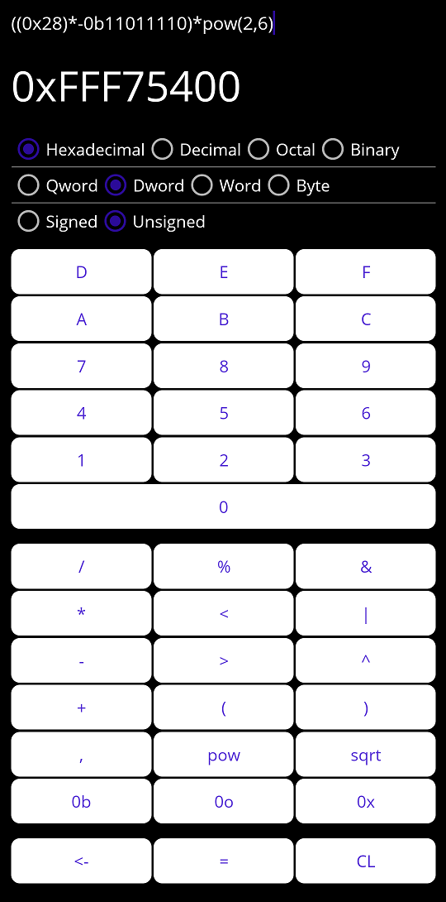

# Devon's Programmer Calculator (Mobile)

A port of the [quick and dirty calculator](https://github.com/DevonArtmeier/Devons-Programmer-Calculator) for programming purposes that I made to mobile devices. Supports:
* Standard mathematical operations
* Binary, octal, decimal, and hexadecimal numbers
* Signed and unsigned numbers
* AND, OR, and XOR operations
* Left and right bit shifting
* pow() and sqrt() functions

It's also designed for easy additions of new operators and functions.